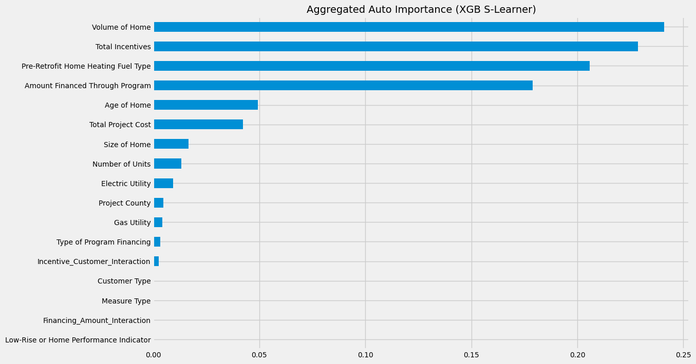
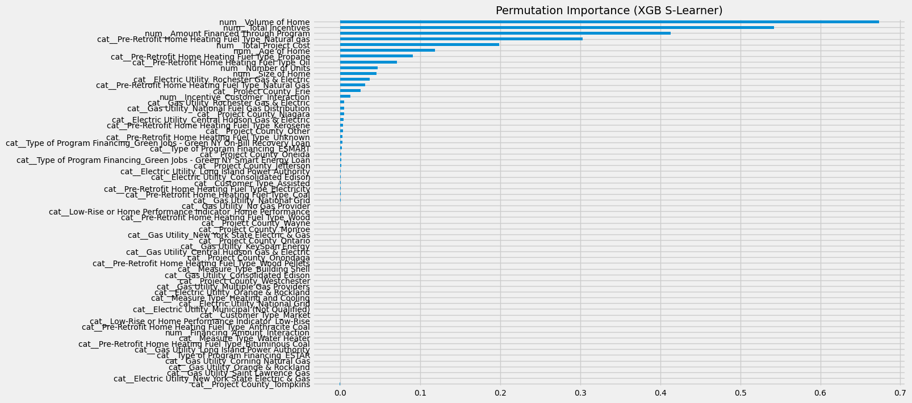
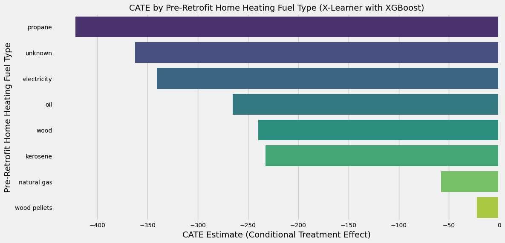

# Causal Inference & Energy Savings — Residential Retrofit Programs

## Project Scope

This end-to-end project combines **machine learning prediction** with **causal inference techniques** to analyze residential energy efficiency data. The goal is twofold:

1. **Prediction Task**: Estimate first-year energy savings for retrofitted homes.
2. **Causal Task**: Understand the true **impact of income-based financial incentives** on energy savings using advanced Causal ML.

---

## **Section I**. Predicting First Year Modeled Energy Savings ($ Estimate)

### Overview

This project aims to develop a **predictive model** to estimate the **First Year Modeled Energy Savings ($ Estimate)** for residential energy efficiency projects. By analyzing variables like project costs, retrofitting measures, and household characteristics, I aim to generate insights to optimize energy efficiency programs and subsidy allocation.

### Use Case

The model supports **program managers and policymakers** by:

- Improving **subsidy design** through identification of key predictors.
- Optimizing **resource allocation** to maximize returns on investment.
- Supporting households in making **cost-effective retrofit decisions**.

### Assumptions

- The target (`First Year Modeled Energy Savings`) is a modeled estimate of post-retrofit energy reduction in dollars.
- Energy prices are **assumed constant** across all projects.

### Data Source

- **Source**: The New York State Energy Research and Development Authority
- **Program**: New York Residential Existing Homes Program
- **Access**: [NYSERDA Data Portal](https://data.ny.gov/Energy-Environment/Residential-Existing-Homes-One-to-Four-Units-Energ/assk-vu73/about_data)

## Prediction Modeling Workflow

### Features Used

- **Financial Variables**: Total Project Cost, Total Incentives
- **Home Characteristics**: Size, Age, Volume, Heating Fuel Type
- **Program Details**: Measure Type, Program Financing, Utilities
- **Geographic Info**: County, Electric/Gas Utility

![Distribution of features and target] (images/Distribution.png)

![Pre-Retrofit Home Heating Fuel Type] (images/Heating Fuel Type.png)

> Observation: Conducting a stratified split based on the 'Pre-Retrofit Home Heating Fuel Type' column, as it is likely to have a significant impact on energy savings (Fuel conversions (e.g., switching from oil to electricity) can cause significant changes in savings).

### Models Trained

- Prediction Model: **Random Forest Regressor** and **Linear Regression**
- Causal Inference Analysis: **XGBoost Regressor**

### Selected Features for Final Model

The following **10 features** were selected based on their contribution to model accuracy:

- `Total Project Cost`
- `Pre-Retrofit Home Heating Fuel Type_Oil`
- `Age of Home`
- `Volume of Home`
- `Size of Home`
- `Total Incentives`
- `Pre-Retrofit Home Heating Fuel Type_Natural Gas`
- `Amount Financed Through Program`
- `Financing_Amount_Interaction`
- `Incentive_Customer_Interaction`

> These features reflect financial inputs, home characteristics, and customer interaction effects that significantly influence modeled energy savings.

### Random Forest Model Performance (Top Features Only)

The final predictive model was a **Random Forest Regressor** trained only on a subset of the most important features, selected based on feature importance analysis.

| Metric                            | Value           |
|----------------------------------|------------------|
| Mean 10-fold CV RMSE                     | **362.61**       |
| Standard Deviation (CV RMSE)     | **9.84**         |

Tree-based model Random Forest outperformed linear models, capturing the complex non-linear interactions between home features, retrofit types, and outcomes.

---
# Section II. Causal ML Analysis: Income-Based Incentives in Residential Retrofit Energy Efficiency Projects

## Objective

This section explores the **causal impact** of income-based (Assisted) vs. market-rate incentives on residential retrofit energy savings using **Causal Machine Learning (Causal ML)**.

Applied:
- S-Learner and X-Learner meta-learners  
- Base models: **Linear Regression**, **Random Forest**, and **XGBoost**  
- SHAP and Permutation Importance for feature interpretability  
- [DoWhy](https://github.com/py-why/dowhy) for effect modifier analysis  

## Modeling Overview

### S-Learner
A single model estimates outcomes by combining treatment and covariates. Useful for simplicity, but limited in capturing treatment heterogeneity.

### X-Learner
Separate models are trained for treated and control groups, allowing richer modeling of **Conditional Average Treatment Effects (CATE)** across subgroups (e.g., by fuel type).

## Key Findings

| Finding | Insight |
|--------|---------|
| **Fuel Type is Critical** | 'Pre-Retrofit Home Heating Fuel Type' was consistently the top feature across all models. |
| **Strong Financial Influence** | Variables like **Total Incentives**, **Total Project Cost**, and **Volume of Home** were major contributors to treatment effects. |
| **Treatment Effect Heterogeneity** | X-Learner revealed significant variation in incentive impact across different fuel types. |
| **Assisted vs. Market** | Income-qualified households consistently experienced greater energy savings, suggesting a strong policy case for targeted assistance. |

---

## Visual Insights

### 1. Aggregated Permutation Importance (S-Learner – XGBoost)

#### Feature Importance Analysis (S-Learner and X-Learner)
- Across models, 'Pre-Retrofit Home Heating Fuel Type' consistently appeared as the most important feature, indicating that fuel switch (from which fuel type to which fuel type) has strong influence on energy savings.
- 'Total Incentives', 'Total Project Cost', Volume of Home' also had strong influences, confirming that financial factors play a key role in energy savings.
- 'Other contributing factors' included Age of Home, Volume of Home, and Gas Utility type.
- By considering 'Pre-Retrofit Home Heating Fuel Type', it identified significant variation in incentive effectiveness, providing actionable insights for program optimization. 

---

### 2. CATE by Fuel Type (X-Learner – XGBoost)

- The effect of assisted incentives varies widely by fuel type.
- Homes using 'Propane' and 'Electricity' saw the largest reductions.
- 'Wood Pellet' and 'Natural Gas' had smaller treatment effects - likely because it is already less energy intensive.
- Understanding this heterogeneity could be key to optimizing incentive structures.

---

## ATE by Fuel Type – X-Learner Results

| Fuel Type       | ATE Estimate |
|-----------------|--------------|
| Natural Gas     | -57.99       |
| Oil             | -265.20      |
| Wood            | -239.83      |
| Electricity     | -340.93      |
| Propane         | -421.74      |
| Unknown         | -362.20      |
| Wood Pellets    | -22.13       |
| Kerosene        | -232.36      |

- The negative ATE values suggest that assisted incentives lead to higher energy savings compared to market incentives.
- Treatment effects for Assisted customers are larger than for Market customers across all fuel types.

## Policy Implications

- **Targeted Incentives**: Tailor subsidies by fuel type and home characteristics.
- **Optimize Resources**: Focus on high-cost fuels (Electricity, Propane) and older homes.
- **Evidence-Based Design**: Use causal insights, not just predictive metrics, to guide program delivery.

---

## 🧪 DoWhy Analysis – Causal Graph & Effect Modifier Tests

I used `DoWhy` to estimate the **Average Treatment Effect (ATE)** of financial incentives using a structural model.

### Effect Modifier: Age & Volume of Home

- **Older homes** with **smaller volume** had the highest treatment effects.
- **Very large homes** showed lower or even negative response to incentives.

### Example Causal Graph

## Conclusion from DoWhy: 'Pre-Retrofit Home Heating Fuel Type'

### Causal Effect Estimation
- The Average Treatment Effect (ATE) was 0.0203, meaning that for every additional dollar in incentives, the expected energy savings increased by 2.03 cents on average.
- However, treatment effects varied significantly by fuel type:
  - Kerosene saw the largest effect (2.46), suggesting high energy savings when incentives were applied.
  - Oil and Propane also had strong positive effects.
  - Natural Gas had the lowest effect (0.0061), indicating that additional incentives may not significantly boost energy savings for homes using this fuel.

## Conclusion from DoWhy: 'Age of Home' and 'Volume of Home'

### Causal Effect Estimation
  - Older homes (108+ years) with smaller volumes (≤10,241 sq ft) had the largest effect (0.048), meaning incentives were most effective in these homes.
  - Larger homes (>19,576 sq ft) consistently showed lower or negative effects, suggesting that incentives might not drive as much energy savings in very large homes.
  - Homes aged 55-83 years also showed moderate treatment effects, reinforcing that mid-to-older homes respond better to incentives than newer homes.

### Refutation Tests

- For both analysis, Placebo Treatment Test suggested the original effect was not driven by random noise. Data Subset Refuter confirmed that the estimate is robust to missing data.

---

